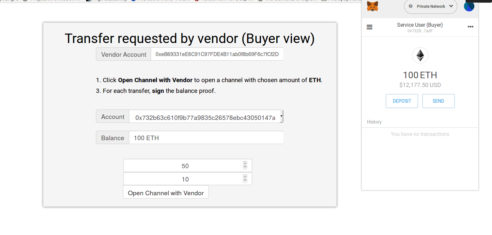
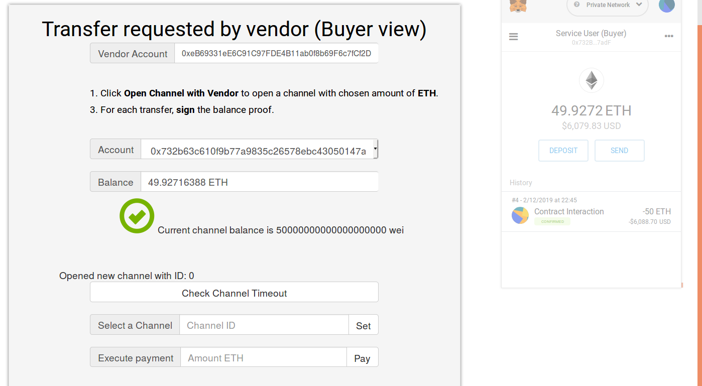
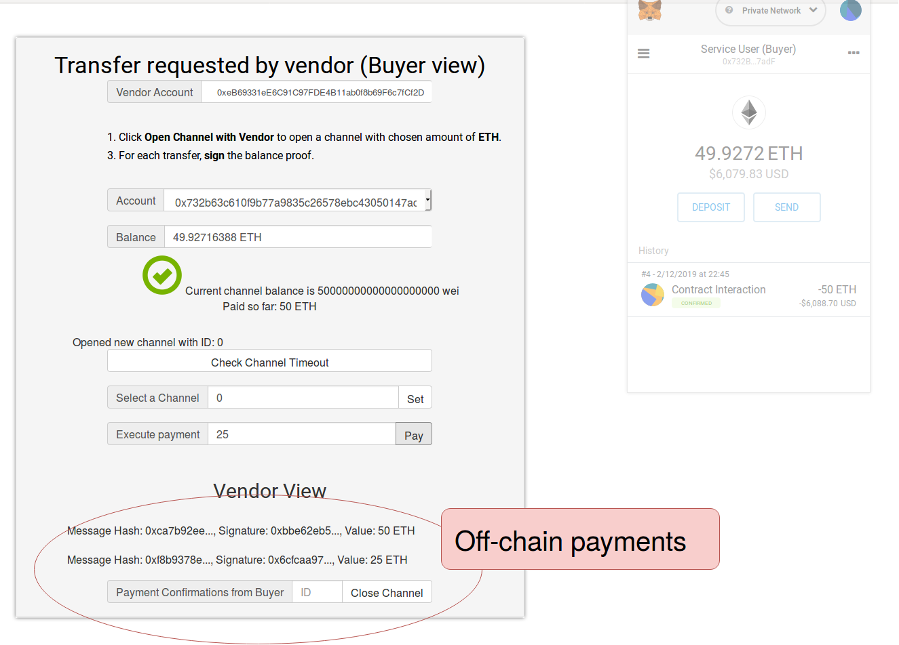
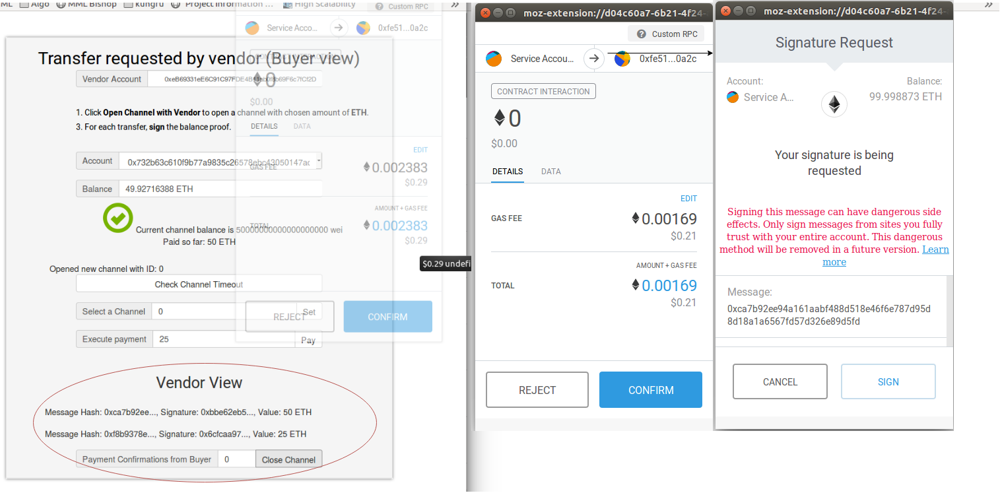
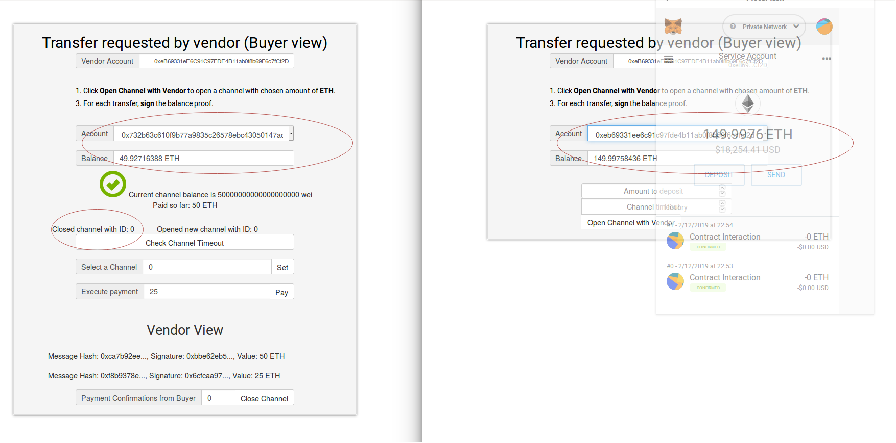

# Unidirectional Micropayment Channel

First install Truffle, Ganache, Metamask and run npm install to get the project dependencies.

Use the following Ganache mnemonic to generate the buyer and sender addresses
used by the smart contract.
Ganache mnemonic: become awake empower census float naive butter latin enlist nephew clock news

There are two modes of the application:
1) Unique self-destroyable channel contract (vulnerable to overwriting)
2) Multiple channel contracts between buyer and seller (not vulnerable to overwriting)

To select one of them, change the "multiChannel" boolean variable in src/js/index.js.

To run the payment channel:
1. Open Ganache with the above mnemonic such that addresses
are generated deterministically for the PoC
2. The Seller's address will be: 0xeB69331eE6C91C97FDE4B11ab0f8b69F6c7fCf2D
   Import this in MetaMask
3. The Buyer's address can be any other address
4. Run the script ./run.sh

You should be able to replicate a scenario similar to this:

**Buyer Identity and Balance retrieved from Metamask. Amount to deposit 50 ETH**

**Channel of 50 ETH opened by Buyer**

**Make Two Off-chain Payments of 25 ETH. Send Proof to Vendor directly. Last payment value is accumulated**

**Vendor Initiates Channel Close: Three TXs (first contract send (buyer proof), sign, second contract send (vendor proof))**

**Final State: Vendor approx 150 ETH and Buyer 50 ETH**

References:
1. Raiden Network: https://github.com/raiden-network/microraiden
2. Payment Channels Tutorial: https://medium.com/@matthewdif/ethereum-payment-channel-in-50-lines-of-code-a94fad2704bc?fbclid=IwAR0gmPllY6lQQf9QiWVoRbRJ4OP0zYnmESwsJDDfGGTCqeRZVuIMkvZvE8c